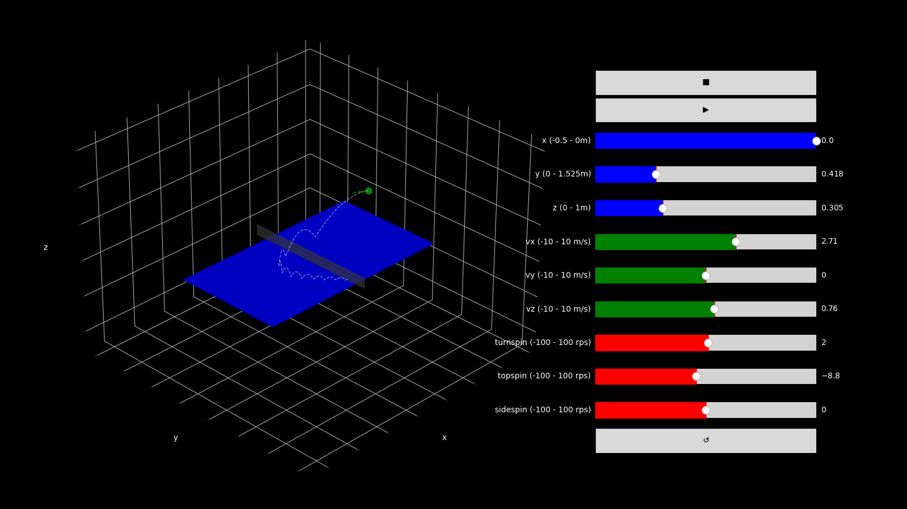

# tt_simulator - interactive animated physics simulation



Interactive Matplotlib animation tool to generate table tennis ball paths through a simple physics simulation. The script was created after discussing how much the ball can turn from the Magnus effect, but this turns out to be a research project in turbulence and air-flow. Nevertheless it is a fun tool, and includes useful code for creating interactive matplotlib animations.

In this repo, the modelling of slip in friction and magnus effect is made up and the Magnus effect and friction is still too strong. To see what happens without any slip, set the no_slip flag, and try out high spin rates.

## Usage

```
python tt_simulator.py
```

## GIF

Create a GIF by setting the initial state in the tt_simulator.py file and run:

```
python tt_simulator.py --gif -o OUTPUT_PATH
```